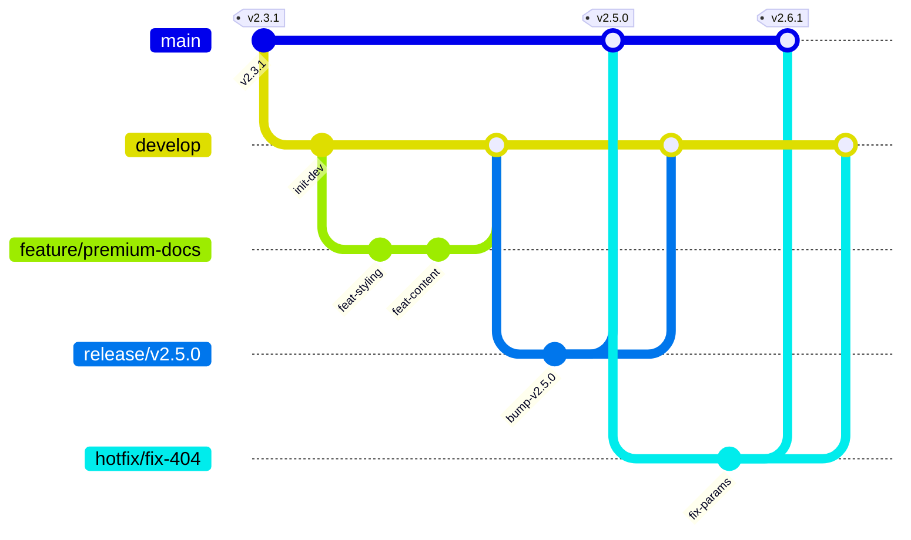

# Git Flow Masterclass: The Industrial Standard 🛡️

Bienvenido al estándar de arquitectura de Git para **Boilr**. Este repositorio sigue una implementación estricta de Git Flow para garantizar que el historial sea auditable, legible y estéticamente profesional.

## 📊 Visualización del Flujo



---

## 🏗️ Estructura de Ramas

### Ramas Core (Eternas)
- **`main`**: Código listo para producción. Cada commit aquí es una versión estable etiquetada.
- **`develop`**: El eje central de la integración. Aquí converge todo el desarrollo activo.

### Ramas de Soporte (Temporales)
- **`feature/*`**: Ramas para nuevas funcionalidades. Siempre nacen de `develop` y vuelven a `develop` sin "fast-forward" (`--no-ff`).
- **`hotfix/*`**: Para correcciones urgentes en producción. Nacen de `main` y vuelven tanto a `main` como a `develop`.
- **`release/*`**: Ramas de preparación para el lanzamiento. Aquí se realizan los bumps de versión y pulido final. **Mandatorio** para cada salto de versión en `main`.

---

## 🛠️ Comandos de Élite

### 1. Iniciar una Funcionalidad
```bash
git checkout develop
git checkout -b feature/mi-nueva-caracteristica
```

### 2. Finalizar una Funcionalidad (El "Merge Bubble")
```bash
git checkout develop
git merge --no-ff feature/mi-nueva-caracteristica
git branch -d feature/mi-nueva-caracteristica
```

### 3. El Ciclo de Release
```bash
# Preparación
git checkout develop
git checkout -b release/v3.0.0

# Ejecución
# (Actualizar versiones, CHANGELOG, etc.)
git add .
git commit -m "chore: release preparations v3.0.0"

# Cierre en Producción
git checkout main
git merge --no-ff release/v3.0.0
git tag -a v3.0.0 -m "Release v3.0.0 - Masterclass Edition"

# Sincronización de Desarrollo
git checkout develop
git merge --no-ff release/v3.0.0
git branch -d release/v3.0.0
```

---

## 💎 Filosofía de Commits

Seguimos una versión estricta de **Conventional Commits** para que el historial sea una obra de arte técnica:

- **`feat`**: Una nueva característica para el usuario.
- **`fix`**: Una corrección de bug.
- **`docs`**: Cambios solo en la documentación.
- **`style`**: Cambios que no afectan el significado del código (espacios, formato, etc).
- **`refactor`**: Cambio que no corrige bug ni añade feature.
- **`chore`**: Tareas de mantenimiento o herramientas.

---
*Boilr: Arquitectura invisible, resultados premium.*
